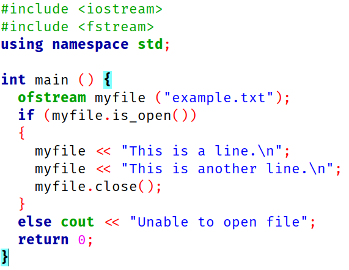
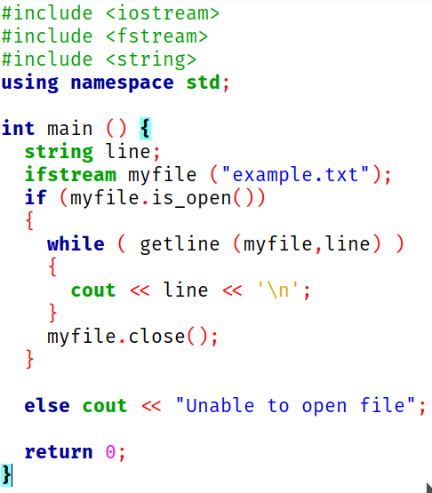

# ใบงานที่ 10 การจัดการไฟล์

## โปรแกรมที่ 1

1.  เปิดไฟล์ lab10_1.cpp
2.  เขียนโปรแกรมตามรูปด้านล่าง  
3.  อธิบายการทำงานของโปรแกรมที่ lab10_1.md

## โปรแกรมที่ 2

1.  เปิดไฟล์ lab10_2.cpp
2.  เขียนโปรแกรมตามรูปด้านล่าง 
3.  อธิบายการทำงานของโปรแกรมที่ lab10_2md

## โปรแกรมที่ 3

1.  เปิดไฟล์ lab10_3.cpp
2.  เขียนโปรแกรมให้ทำงานดังนี้
    -   กด 1 เพื่อเพิ่มชื่อนักศึกษาและบันทึกลงไฟล์ชื่อ std.txt
    -   กด 2 เพื่อแสดงชื่อนักศึกษาที่เก็บไว้ใน std.txt
    -   กด 3 เพื่อออกจากโปรแกรม
3.  อธิบายการทำงานของโปรแกรมลงใน lab10_3.md
